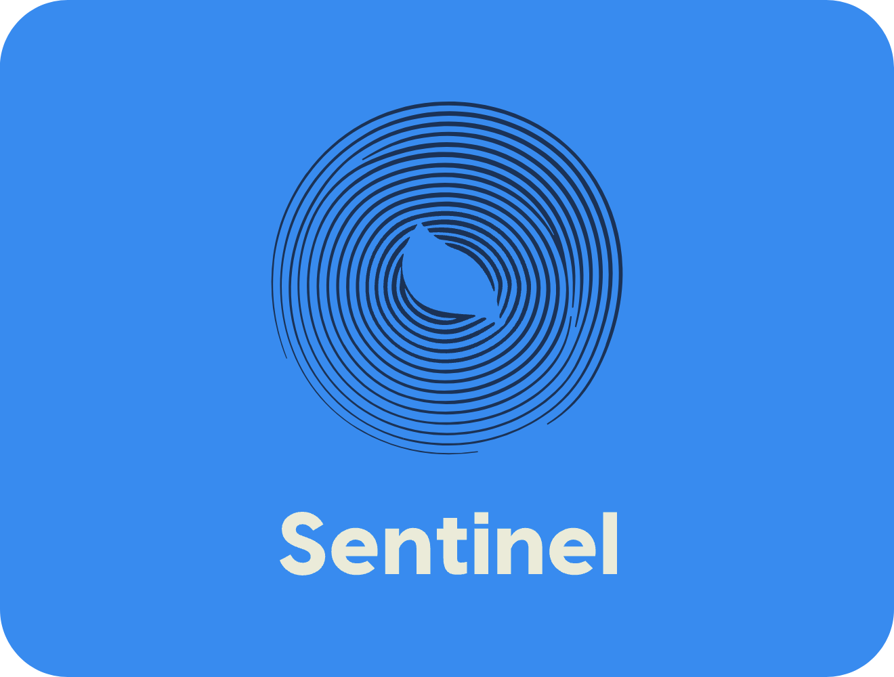

<p align="center">
    
    
    
    
    
    
</p>

## 📌 What is it?
- Sentinel is a real-time security event detection system powered by TwelveLabs' intelligent video understanding API. This proof-of-concept processes video feeds (webcam or pre-recorded) to detect security-relevant events such as unauthorized entries, unattended objects, or suspicious behavior — all with low latency and a minimal web interface for alerts and monitoring.

## TOC
> [Description](#what-is-it)<br>
> [Features](#features)<br>
> [Usage](#installation-and-usage)<br>
> [Tech Stack](#tech-stack)
> [Credits](#credits)<br>
> [License](#license)<br>
> [Understanding Commits](#commits-key)<br>

## Features
| Feature    | Implemented? |
| -------- | ------- |
|Real-time video processing using YOLO|🟡|
|Event detection with TwelveLabs Search API|🟡|
|Visual alerts with timestamps and confidence scores|🟡|
|Modern React interface with real-time updates|🟡|
|Dark/light mode for comfortable viewing in security settings|🔴|
|Recording playback and event timeline|🔴|
|Analytics and reporting dashboard|🔴|
|Performance-optimized for low-latency monitoring|🔴|

## Installation and Usage
1. Download the ZIP file or clone repository; move to intended run-directory.
2. Set up a virtual environment
   ```
   python -m venv sentinel-venv
   ```
3. Install the requirements
   ```
   pip install -r requirements.txt
4. Start the application
   ```
   streamlit run main.py --server.port 5001
   ```
5. Open your browser and navigate to http://localhost:5001

## Tech Stack
- **React.js** - For building the UI components
- **Tailwind CSS** - For styling with modern aesthetics
- **React Router** - For navigation between different views
- **Chart.js** - For metrics visualization

## Credits
- Twelvelabs API
- Made with
    - [](#) [](#)
- Made on
    - [](#)
- Made for
    - [](#) [](#)

## License
- Located [here](https://github.com/A7M-Labs/Sentinel/blob/main/LICENSE.md).

### Commits Key
- SAFE: Stable and production-ready code; can be safely deployed.
- TEST: Code meant for testing or experimental changes; safe but does not affect the main program directly; stable for version control.
- UNST: Unstable commit with potential issues; not suitable for production, used for backup or testing phases.
- HTFX: Hotfix for critical issues.
- REFA: Refactor or restructure code for improved readability, maintainability, or efficiency, with no changes to core functionality.
- RESD: Revert previous changes due to instability or issues encountered during testing; restores the code to a prior stable state.
- BUGF: Bug fix or issue resolution, fixing known problems in the code without adding new functionality.
- DOCS: Documentation update, including comments, README files, or other forms of documentation to improve clarity and understanding.